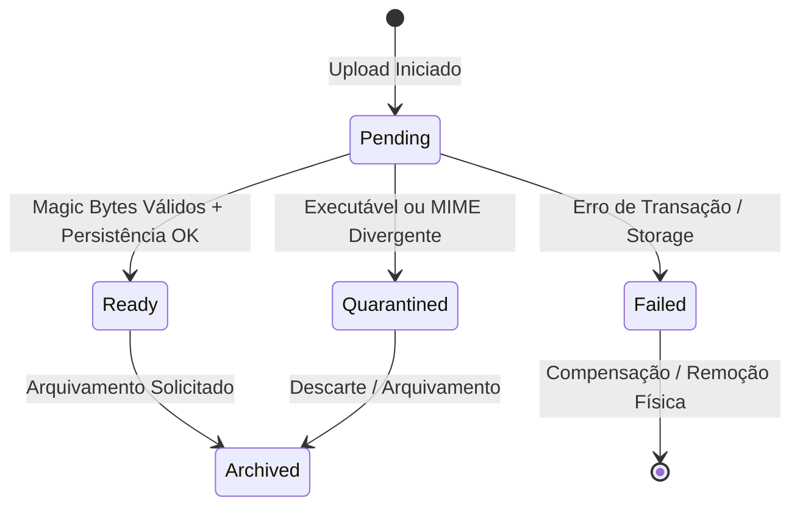

# Documentação 5W2H — PR 02: Anexos Clínicos Duráveis e Seguros

## 1. Matriz 5W2H
- **What (O que):** Reestruturação completa da arquitetura de anexos clínicos:
  1. Criação da interface `AttachmentStorage` com suporte aos adapters `LocalAttachmentStorage` (desenvolvimento/testes) e `S3AttachmentStorage` (produção).
  2. Remoção integral de chamadas síncronas `writeFileSync`/`readFileSync` e eliminação de nomes físicos concatenados com PII ou nome do paciente.
  3. Verificação obrigatória de Magic Bytes via `DevAttachmentScanner`, bloqueando executáveis (DOS MZ, ELF, scripts) e divergências entre MIME declarado e detectado.
  4. Validação estrita de Base64 e limitação de tamanho em 10MB sem estouro de memória.
  5. Mapeamento de ciclo de vida com a máquina de estados: `pending`, `ready`, `quarantined`, `failed`, `archived`.
  6. Compensação atômica contra arquivos órfãos (deleção no storage em caso de falha na transação PostgreSQL).
  7. Download seguro com cabeçalhos `Content-Disposition`, `X-Content-Type-Options: nosniff` e `Content-Security-Policy: default-src 'none'`.
- **Why (Por que):** Prevenir spoofing de anexos, vazamento de PII em chaves físicas de storage, inconsistências em infraestruturas efêmeras/multi-instância e acúmulo de arquivos órfãos silenciosos.
- **Where (Onde):** `src/domain/attachments.ts`, `src/config.ts`, `src/app.ts`, `migrations/015_secure_attachments.sql`, `tests/secure-attachments.test.ts` e `docs/5w2h-pr02-secure-attachments.md`.
- **When (Quando):** Ciclo da entrega `codex/pr-02-secure-attachments`.
- **Who (Quem):** Equipe Antigravity.
- **How (Como):** Migração aditiva em PostgreSQL, abstração de storage com fábrica baseada no ambiente, scanner de cabeçalho binário e transação transacional com compensação explícita `try/catch`.
- **How Much (Quanto Custa):** Sem custo operacional adicional; compatibilidade imediata com S3 / MinIO / Cloudflare R2 ou disco local.

---

## 2. Ciclo de Vida e Estados dos Anexos Clínicos

| Estado | Descrição | Permite Download? |
|---|---|---|
| `pending` | Upload em andamento / em processamento | Não (`403 Forbidden`) |
| `ready` | Anexo auditado, verificado e disponível | Sim (`200 OK` + headers seguros) |
| `quarantined` | Retido por falha nos Magic Bytes ou divergência MIME | Não (`403 Forbidden`) |
| `failed` | Falha no processo de gravação | Não (`403 Forbidden`) |
| `archived` | Arquivado historicamente pelo usuário | Não (`404` / `403`) |

---

## 3. Política de Compensação e Eliminação de Órfãos

1. **Falha do Banco após Upload no Storage**:
   O bloco `catch` executa `await attachmentStorage.delete(storageKey)` imediatamente antes de propagar o erro, garantindo que nenhum arquivo permaneça no storage sem registro no PostgreSQL.
2. **Falha do Storage durante Salvamento**:
   A transação do banco nem chega a ser aberta (`BEGIN`), retornando erro `500 Internal Server Error` sem efeitos colaterais.
3. **Reconciliação Administrativa de Órfãos**:
   Endpoint `/api/admin/reconcile-attachments` e função `reconcileOrphanAttachments` varrem o storage e removem objetos que não possuem correspondência em status `ready` ou `archived` no banco.

---

## 4. Testes & Cobertura
- `npm run typecheck`: 0 erros.
- `npm test`: 49 testes com 100% de aprovação (incluindo testes contratuais de S3, Local, Magic Bytes e compensação de falha).
- `npm run build`: Build de produção executado com sucesso.
- `npm audit --audit-level=high`: 0 vulnerabilidades.

---

## 5. Plano de Rollback
- Reverter o merge da branch `codex/pr-02-secure-attachments`.
- Caso a migração `015_secure_attachments.sql` tenha sido aplicada, as colunas adicionadas possuem valores padrão (`DEFAULT 'local'`, `DEFAULT ''`, `DEFAULT 'ready'`), mantendo compatibilidade total com versões anteriores da aplicação.
